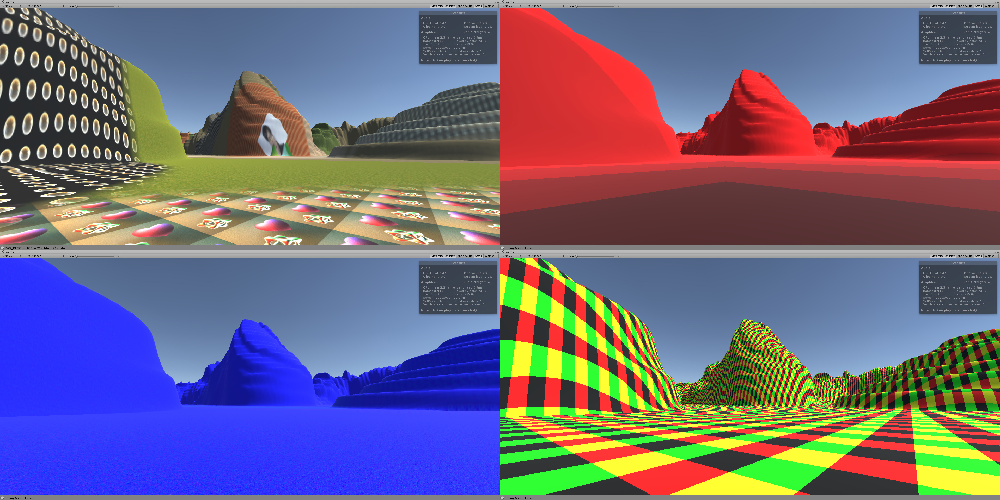
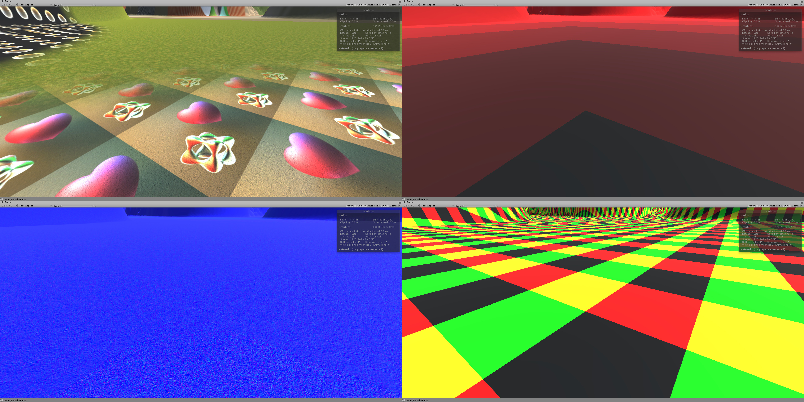
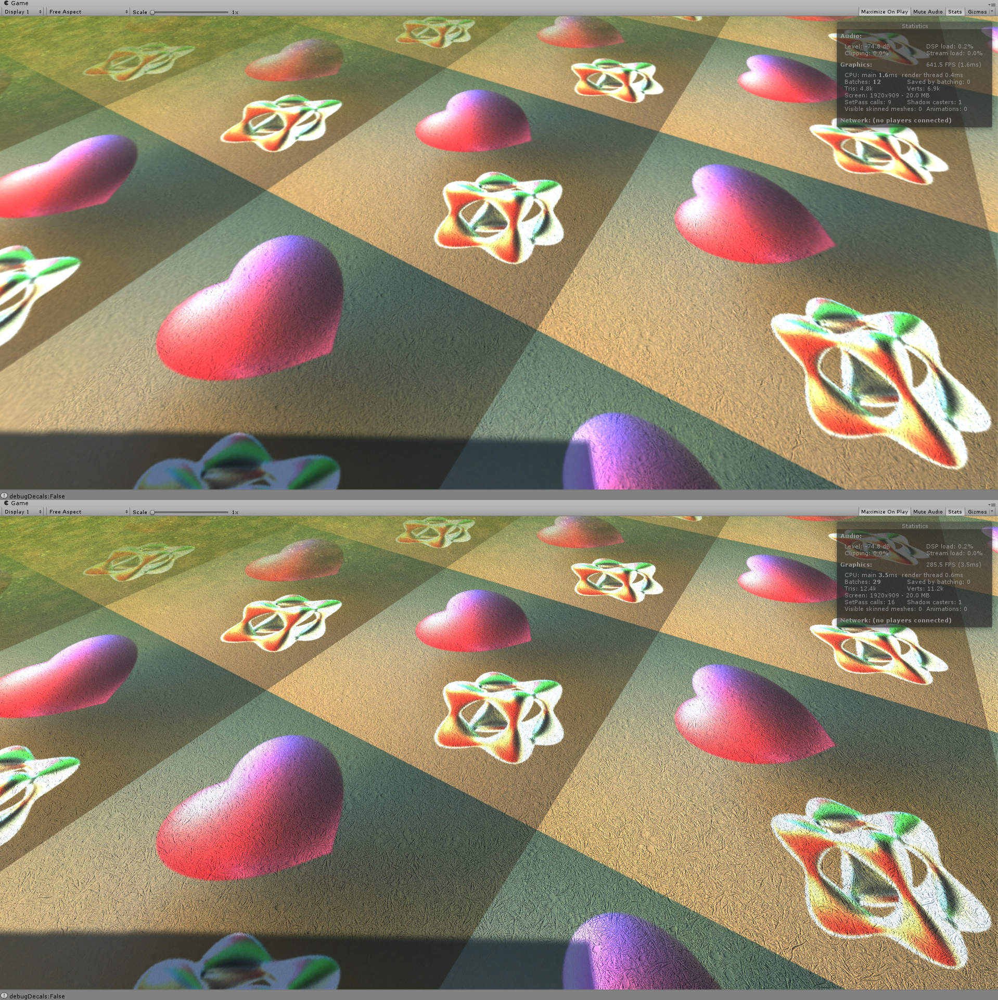
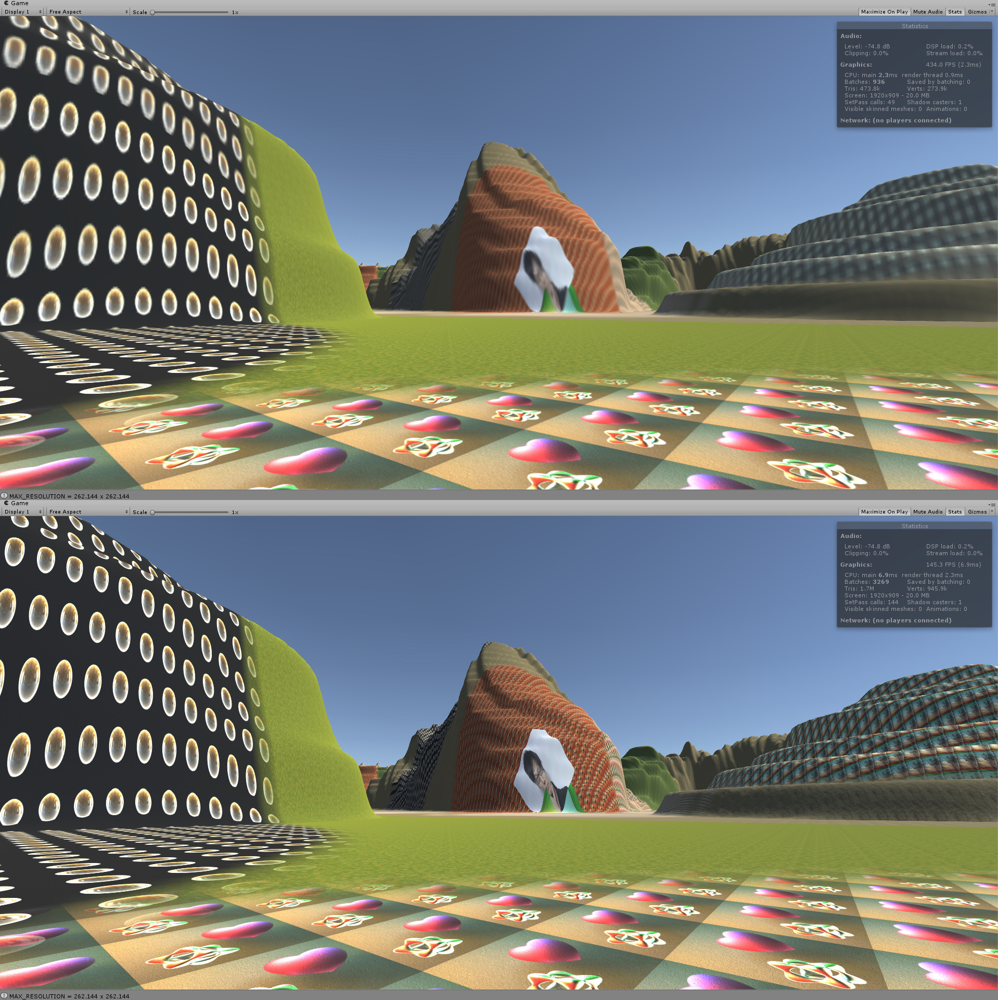
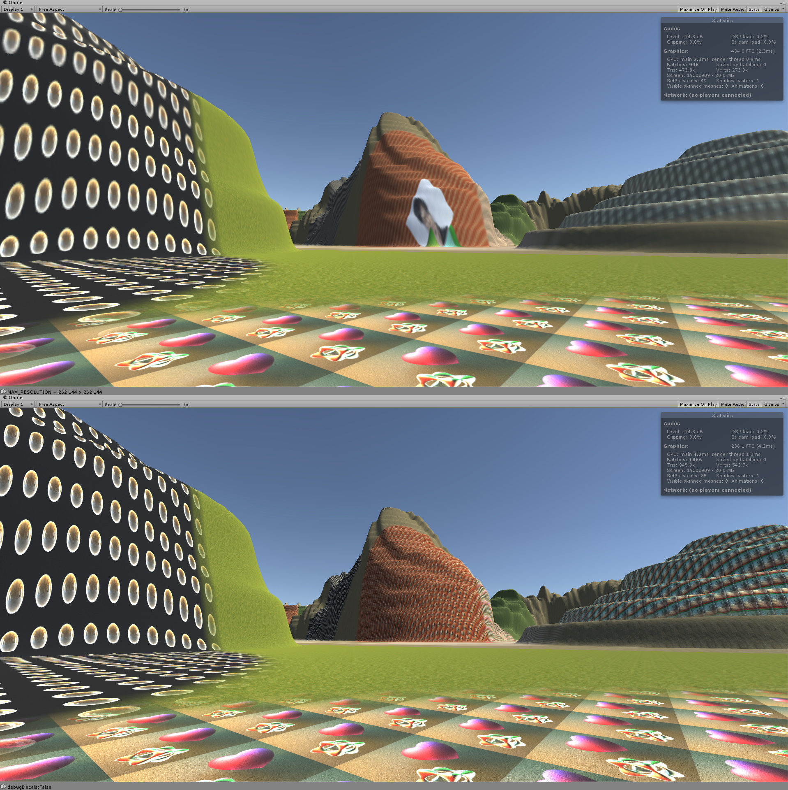
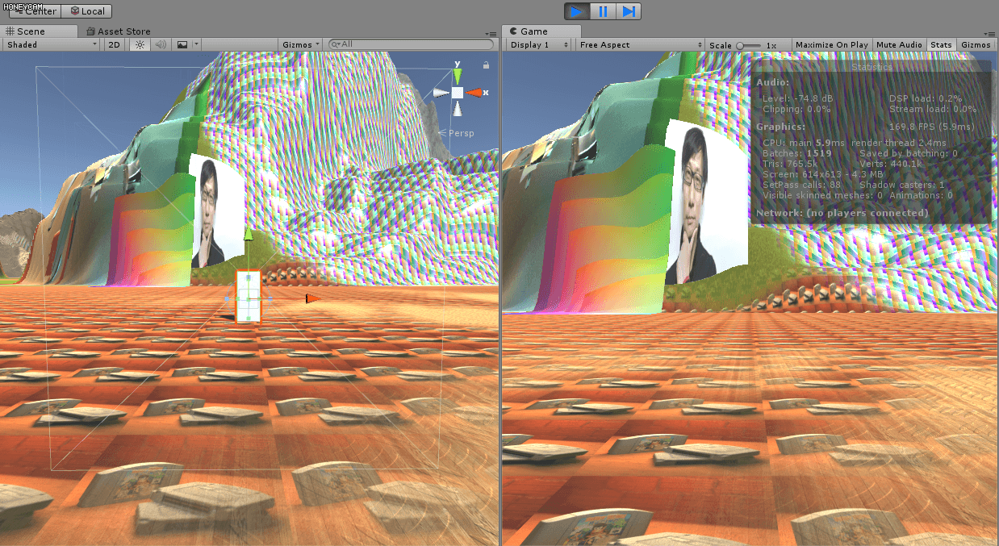

# Procedural Virtual Texture with Unity Terrain

## OVERVIEW

PVTUT is an Unity plugin which implemented procedural virtual texture with Unity terrain(PVTUT). It supports up to 12 splat maps per terrain. PVTUT improves framerate at the expense of the texture quality at distance. Also, it will take up a lot of VRAM space, so this is a trade-off between space and time.

PVTUT also supports vertically placed terrain decals. In this case, it is using a free Unity plugin called Dynamic Decals to provide in-editor preview. In run-time, all Dynamic Decals objects will be disabled, all decals you see are baked in the texture.

PVTUT supports multi-terrain layout, which means you can have more than 12 splat maps in your scene in total.

You can find all the references at [GDC vault](https://www.gdcvault.com/), but just in case, these are some other links to the same material.

* [Adaptive Virtual Texture](http://twvideo01.ubm-us.net/o1/vault/gdc2015/presentations/Chen_Ka_AdaptiveVirtualTexture.pdf)

* [Procedural Virtual Texture](https://media.contentapi.ea.com/content/dam/eacom/frostbite/files/gdc12-terrain-in-battlefield3.pdf)

* [Mega Texture](http://s09.idav.ucdavis.edu/talks/05-JP_id_Tech_5_Challenges.pdf)

## SHOWCASE 1

### PVTUT Composite(final result, LOD level, normal, tile layout)

## SHOWCASE 2

### PVTUT(up, 1.6ms) v.s. Unity Terrain with Standard Terrain Shader(shadow casting off, 3.5ms)

## SHOWCASE 3

### PVTUT Composite(final result, LOD level, normal, tile layout)

### PVTUT(up, 2.3ms) v.s. Unity Terrain with Standard Terrain Shader(shadow casting off, 6.9ms)

### PVTUT(up, 2.3ms) v.s. Unity Terrain with Standard Terrain Shader(shadow casting off, Dynamic Decals disabled, 4.2ms)

## SHOWCASE 4 (in motion)

### Composite

### Final Result

### LOD levels

## DETAILS

### Intro

PVTUT is based on the 2014 GDC talk Adaptive Virtual Texture presented by Ka Chen from Ubisoft. The idea is to decrease rendering time by reducing how many times that terrains sample the splat textures. 

### Splatmap

Most terrain systems utilize a technique called splatting to render massive area of terrains while producing a relatively unique look. In general, you would want to texture a terrain just like any other object, by supplying one unique texture. However, this texture has to be unrealistically large to match the massive area of the terrain. For a small scene, this naive method will do. But if you are making an open world game, it is not possible(if no tricks are applied, e.g. Megatexture). So, for a higher resolution, game developers decide that a repeated pattern is tolerable. If we set the uv coordinates of the terrain to some value larger than 1, then the resolution of the result will be increased. But how to break the repeated pattern? Use more textures! If we blend 2 repeated pattern evenly, with a little offset and scaling, the result looks already better. If we use a separate texture's RGB value to control the blending weight, the repeated pattern looks almost gone.

### Virtual Texture

With splatting comes the problem of the long sampling time in a shader. If we are splatting 4 textures together, then we are going to sample 5 textures in total to render one pixel. What if we can sample only one time? This is the purpose of virtual texture. In general, if all the texture I need to render the current frame is stored all in one texture, then I only need to bind one texture for this frame to avoid the context transition, which will increase the frame rate. We can either generate this single massive texture for all objects(A.K.A. Megatexture), or we can use this technique only on terrains that using splat maps(A.K.A. Procedural Virtual Texture). 

### Procedural Virtual Texture

If we can store the blended result in one texture, then the time of sampling multiple textures will be saved. Since terrains are often large, the texture can not be entirely saved in VRAM. So we need to procedurally generate the ones we need and discard the ones which is not currently needed. (It may sounds scary, since we are rendering textures every frame but the good news is they are small quads, so it's not that costly.) If we need every inch of the terrain to has the best quality at same time, it will be a waste of storing space, since we don't care how detailed the terrain could be if it only take one pixel in the distance(or even being occluded by other objects), let alone it is unrealistic to store all these data. 

### Level Of Detail

So, how do we decide which part of the terrain needs which level of detail? In Megatexture, id software uses a feedback buffer to decide which part of the texture can be seen and only put those parts in the single massive texture. In Procedural Virtual Texture(Battlefield3 and FarCry4), position and view direction is enough for terrain rendering. In my implementation, I simply use position. This means, if you only look around without moving, there will be no texture baking happens.

### Storage

The texture will be stored in VRAM, so how do we do it? There are two general options. Either store them in one texture atlas(normally smaller than 8192x8192) or store them in a texture array. No matter where we store them, it will always require a tiling system to map different sections of the texture to different parts of the object(terrain in our case) or even different objects(in the case of Megatexture). The two options have their pros and cons. PVTUT uses texture arrays to store the data. One LOD has one texture array assigned to it.

### Mipmap

The reason PVTUT uses texture arrays is that it is relatively easier(or faster) to generate mipmaps for a texture array than a texture atlas. Why do mipmaps matter? As mentioned above, PVTUT uses position to decide LOD of a particular area of the terrain. If a hill and a plain exist at the same area, we want to use at least tri-linear sampling to avoid aliasing, pixel jittering in particular. That means for that area, we need the whole mipmap chain to exist in VRAM. We can either generate mipmaps by ourselves(software approach) or generate them using GPU(hardware approach), (FarCry4 uses software approach to store only two mipmap level for each area, but I don't know how they decide the resolution of the two level), which is used by PVTUT.

### Indirection Method

As metioned above, there will always be a tiling system to map the original uv of the object to the ones used in the virtual texture. In Megatexture, I believe they modified the uv of the models off-line because they don't need to procedurally generate any textures. In Procedural Virtual Texture, indirection texture or indirection table can be used to handle the UV coordinates conversion. PVTUT uses one indirection texture for each LOD texture array. The terrain uses its original uv to sample the indirection texture to get the final coordinates.

### Clipmap

If we store the indirection data for every part of every LOD in textures, the indirection data can be massive.If you divide your terrain into 1024x1024 tiles, The finest LOD indirection texture will be 1024x1024 pixels. Everytime you bake a finest tile of the terrain, you will have to update this 1024x1024 texture. However, we don't need the indirection texture to be so large, because the coarser LOD of the tiles far from us are used. And depending on your texture array setup, those unused finer tile may not be resident at all. So we don't need to store their indirection information. PVTUT uses a 64x64 indirection texture for each LOD texture array(just like Battlefield3, not sure about FarCry4). The wrapping mode of the indirection texture is set to repeat. This way, we can just use this texture as it's infinite large, and all new pixels will be set to the position of old pixels. This technique is called clipmap.
Since we have several LODs, we use several indirection maps. This can guarantee all the area of the terrain will be covered in new pixels(but for different LOD). 

## PROBLEMS & SOLUTIONS

This section is for the problems that I encounted, what caused them and the solutions to them.

### Tile Crease

When using translated uv coordinates to sample from the texture arrays, I noticed there were thin outlines between different tiles. The reason for that is when sampling with tex2D(texture, uv), the two mipmap levels being used are calculated by the derivative of uv coordinates. Since we are sampling using the uv in a texture array, the u coordinates of the rightmost pixel of a tile is 1 and the u coordinates of the leftmost pixel of the tile on the right of it is 0. This makes the derivative wrong and the GPU will use the coarsest level of mipmap to sample the color because it thinks the texture is being projected to a really small area. This makes the color become grayish. The solution to it is to use tex2DGrad(texture, uv, ddx(uv), ddy(uv)) which requires modified derivatives.

### Multiple Decal in One Tile

If there is a decal in a tile, we need to use one drawcall to render the decal as well. If there are several of them, the rendering will be slow. To solve that I used instanced rendering. Using instanced rendering in Unity is not that straight forward. There are some little details to notice. Apart from the information on their website, I had to enable ¡°keep all shader variants¡± to keep instanced rendering work in a built version. Also, to make the shader compile correctly, I find out unity_ObjectToWorld matrix has to be used. However in my case, I don¡¯t really need it to perform the object space to world space transformation, since I am just drawing quads in screen space. But to keep the shader compile, I simply store all other information that I need in to this matrix and access them in the shader.

### Multiple Channel in One Tile

Unity terrain supports a normal map for each splat map. This requires a separate virtual texture to store. In my case, I created an extra texture array for each LOD to store normals. When rendering, we need to use one drawcall to render a texture. But if there are two texture(color and normal) to render, it¡¯s going to take two drawcalls. To decrease drawcalls, I used multiple rendering target. This is relatively easy in Unity, but to combine instanced rendering and texture2darray with it makes it way harder to get around in Unity because of the limited APIs. Finally, I get around with it by using non-command buffer version of SetRenderTarget and a command buffer to solve it.

### Lagging and Stuttering

If you update too many tiles in one frame or the quality of the tile is too high, then the game will lag and stutter. The reason is simple and complicated. It is simple because the GPU has too many data to process. It is complicated because it involves the synchronization between CPU and GPU, as well as the rendering thread of Unity. Thus, the simplest solution is to limit the number of the tiles that get updated every frame and lower the texture resolution. The trickiest solution is to separate the texture baking command and the Unity scene rendering command as possible as it can be. I am not familiar with multi-threading in Unity so I went for the simpler way, executing the baking commands as soon as possible. According to the Unity documentation, FixedUpdate is always ahead of Update and happens in a frame-independent time step. So, I moved the baking commands to FixedUpdate and also added a counter to control its frequency.

### Unity Add Pass

Unity terrain system use a hidden renderer to draw the terrain. It will detect how many splat maps are stored in the terrain data. If there are more than 4 splat maps, it will automatically add a separate pass to render the result of the extra 4 splat maps until all splay maps are accounted for. Thus, if I just swap the material of a terrain with my own, the hidden renderer will still think it needs the extra pass which is exactly what PVTUT tries to solve. To bypass that, I had to duplicate similar terrain data except there is only one splat map and use PVTUT to render a new terrain with these terrain data while disabling the original ones(you can also destroy them if you want, they are only needed to create the baking material). 